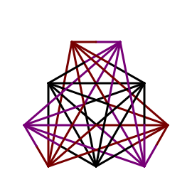

  

Criei esse resumo para ajudar pessoas trans após a mudança do nome no cartório, com os outros documentos. Se conhecerem pessoas trans, ou conhecerem quem conheça, compartilhe.

Quando veio finalmente a certidão retificada, além da felicidade, veio a chuva de documentos que teria que alterar. O que, salvo exceções, foi lindo também, porque é foda demais chegar pras pessoas e dizer "tá vendo esse nome aí? Essa pessoa não existe mais, a justiça resolveu me respeitar! Corrige aí pra mim".

Fiz um [kanban*](https://github.com/darakeon/lcsd/projects/1) pros documentos que eu precisava alterar. Fui colocando documento a documento, e movendo conforme ia avançando. Agora estou quase terminando. E feliz.

### Regulamentação da mudança direto em cartórios

- [Dados do ato normativo](http://www.cnj.jus.br/atos-normativos?documento=2623)
- [Texto do ato normativo](http://www.cnj.jus.br/busca-atos-adm?documento=3503)

### Pontos a ressaltar

- O primeiro documento depois da [certidão](https://github.com/darakeon/lcsd/issues/1) é uma boa ideia ser o [RG](https://github.com/darakeon/lcsd/issues/2), é pedido em várias outras alterações;

- Não deixe de levar a [certidão de nascimento](https://github.com/darakeon/lcsd/issues/1) por causa do [RG](https://github.com/darakeon/lcsd/issues/2), em todas as alterações seguintes. Se precisar alterar o gênero em algum cadastro, o RG não tem o gênero (grazadeus);

- Assim que alterar no [RG](https://github.com/darakeon/lcsd/issues/2), vá alterar na [Receita Federal](https://github.com/darakeon/lcsd/issues/3). Todas as instituições financeiras me perguntaram se já tinha feito isso, e me disseram que não poderiam alterar se não tivesse feito;

- Quando for alterar na [Receita Federal](https://github.com/darakeon/lcsd/issues/3), tenha um documento com o nome anterior, tipo a carteira de trabalho, ou se tiver alguma cópia de certidão de nascimento que tava errada (ou seria erridão?);

- O Poupatempo altera diversos documentos, entre eles: [RG](https://github.com/darakeon/lcsd/issues/2), [CNH](https://github.com/darakeon/lcsd/issues/10), [Carteira de Trabalho](https://github.com/darakeon/lcsd/issues/9), [Título de Eleitor](https://github.com/darakeon/lcsd/issues/13). Não lembro se não tinha mais;

- Caso não te digam isso: não coloque fogo na [Carteira de Trabalho](https://github.com/darakeon/lcsd/issues/9) anterior. É necessário guardar, não serão refeitos todos os registros dela na nova. O resto dos documentos acho que rola usar pra ajudar num dia frio - gente, pelamor, se for fazer mesmo isso, cuidado pra não estrear cedo demais a carteirinha de convênio alterada;

- Caso tenha emprego, leve a [Carteira de Trabalho](https://github.com/darakeon/lcsd/issues/9) para registrar o seu [emprego atual](https://github.com/darakeon/lcsd/issues/6), esse deve ser registrado novamente;

- Um tempo antes da eleição, alterações no [Título de Eleitor](https://github.com/darakeon/lcsd/issues/13) não são permitidas. Pois é, vou ter que votar uma eleição a mais com documento errado, só posso alterar 5/11;

- Se você tiver com o documento como masculino agora, vá a junta militar mais próxima de sua casa (não é uma mera recomendação, você não pode mesmo fazer isso em outra) e se aliste. O [reservista](https://github.com/darakeon/lcsd/issues/7) é um documento exigido por muitas empresas para contratar. Não devem te chamar, mas talvez queiram de você pague uma tarifa (que é menos de R$6) por se alistar "atrasado";

É isso que lembro. Se tiver alguma dúvida, se cadastra aqui no [github](https://github.com/) e bota a dúvida no cartãozinho onde tem o documento que você tem dúvida. Se eu puder ajudar, ficarei feliz!

*&ast; kanban, de forma simplificada, é uma lista de tarefas que tem coluninhas de cada estágio do que você tá fazendo*
